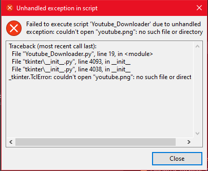
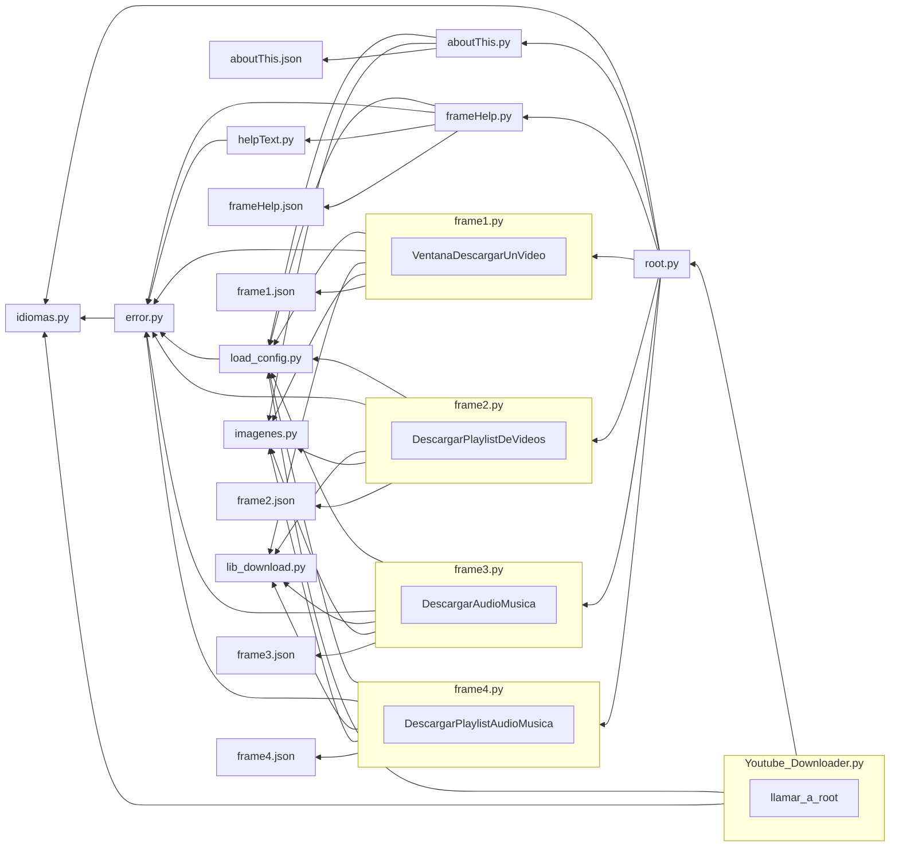

# Programa para descargar vídeos de YouTube

---

Script creado en Python para descargar vídeos de YouTube en la máxima resolución, simplemente copiando y pegando el enlace del vídeo.

<p align="center">
  
</p>

Tenemos disponible la versión .exe (la que viene comprimida en formato zip) y la versión .py para tener acceso al código del programa.

Los vídeos de YouTube se descargarán en el mismo directorio donde se encuentra ubicado el programa.

---

### Clonar con:

```batch
git clone https://github.com/Maalfer/Youtube_Downloader.git
```

y acceder a la carpeta con:

```batch
cd Youtube_Downloader
```

---

### Instalacion de librerias:

```batch
pip install -r requirements.txt
```

---

### Idiomas permitidos:

Este software tiene soporte a los siguientes idiomas:

- Español (es_ES).
- Ingles (en_US).
- Chino (zh_CN).
- Ruso (ru_RU).
- Frances (fr_FR).
- Arabe (ar_EG).
- Japones (ja_JP).
- Aleman (de_DE).
- esperanto.

```Python
self.es_ES     = "es_ES" # Español
self.en_US     = "en_US" # Ingles
self.zh_CN     = "zh_CN" # Chino
self.ru_RU     = "ru_RU" # Ruso
self.fr_FR     = "fr_FR" # Frances(Francia)
self.ar_EG     = "ar_EG" # Arabe Egipto(el mas similar al estandar)
self.ja_JP     = "ja_JP" # Japones
self.de_DE     = "de_DE" # Aleman(Alemania)
self.esperanto = "esperanto" # esperanto
```

---

### Lectura del archivo README.md y LICENSE

- Para Windows:

```batch
type README.md | more
type LICENSE | more
```

- Para Linux:

```bash
cat README.md | more
cat LICENSE | more
```

---

### Ejecutar con:

```batch
python Youtube_Downloader.py
```

- En caso de que usted use Windows y no tenga `python` instalado:

```batch
start Youtube_Downloader.exe
```

---

### Generar un ejecutable con:

```batch
pyinstaller --onefile -i youtube.ico  Youtube_Downloader.py
```

Si fuera necesario. El archivo .exe generado se encuentra alojado en la carpeta "`dist`", esta se ubica donde se encontraba el script `Youtube_Downloader.py`. Si se les da la casualidad de que se les genera un error similar a este:

<p align="center">
  
</p>

Es debido a que el archivo `youtube.png` y el ejecutable han de ir juntos, y la imagen a de tener el mismo nombre. Para solucionarlo basta con mover el `.exe` a la misma carpeta en la que se encuentra la imagen.

Si a usted se le genero un error como el siguiente:
```Python
236 INFO: PyInstaller: 3.4
236 INFO: Python: 3.10.9
237 INFO: Platform: Linux-6.0.0-kali6-amd64-x86_64-with-glibc2.36
237 INFO: wrote /home/desmon/Documentos/GitHub/Youtube_Downloader/Youtube_Downloader.spec
239 INFO: UPX is available.
240 INFO: Extending PYTHONPATH with paths
['/home/desmon/Documentos/GitHub/Youtube_Downloader',
 '/home/desmon/Documentos/GitHub/Youtube_Downloader']
240 INFO: checking Analysis
240 INFO: Building Analysis because Analysis-00.toc is non existent
240 INFO: Initializing module dependency graph...
241 INFO: Initializing module graph hooks...
244 INFO: Analyzing base_library.zip ...
2500 INFO: Processing pre-find module path hook   distutils
3123 INFO: running Analysis Analysis-00.toc
3136 INFO: Caching module hooks...
3137 INFO: Analyzing /home/desmon/Documentos/GitHub/Youtube_Downloader/Youtube_Downloader.py
3367 INFO: Loading module hooks...
3367 INFO: Loading module hook "hook-encodings.py"...
3387 INFO: Loading module hook "hook-xml.py"...
3439 INFO: Loading module hook "hook-xml.etree.cElementTree.py"...
3440 INFO: Loading module hook "hook-distutils.py"...
3442 INFO: Loading module hook "hook-sysconfig.py"...
3446 INFO: Loading module hook "hook-_tkinter.py"...
3480 INFO: checking Tree
3480 INFO: Building Tree because Tree-00.toc is non existent
3480 INFO: Building Tree Tree-00.toc
3485 INFO: checking Tree
3485 INFO: Building Tree because Tree-01.toc is non existent
3485 INFO: Building Tree Tree-01.toc
3487 INFO: Loading module hook "hook-pydoc.py"...
3487 INFO: Loading module hook "hook-lib2to3.py"...
3492 INFO: Looking for ctypes DLLs
3500 INFO: Analyzing run-time hooks ...
3502 INFO: Including run-time hook 'pyi_rth_multiprocessing.py'
3504 INFO: Including run-time hook 'pyi_rth__tkinter.py'
3508 INFO: Looking for dynamic libraries
3667 INFO: Looking for eggs
3667 INFO: Python library not in binary dependencies. Doing additional searching...
Traceback (most recent call last):
  File "/home/desmon/.local/bin/pyinstaller", line 8, in <module>
    sys.exit(run())
  File "/home/desmon/.local/lib/python3.10/site-packages/PyInstaller/__main__.py", line 111, in run
    run_build(pyi_config, spec_file, **vars(args))
  File "/home/desmon/.local/lib/python3.10/site-packages/PyInstaller/__main__.py", line 63, in run_build
    PyInstaller.building.build_main.main(pyi_config, spec_file, **kwargs)
  File "/home/desmon/.local/lib/python3.10/site-packages/PyInstaller/building/build_main.py", line 838, in main
    build(specfile, kw.get('distpath'), kw.get('workpath'), kw.get('clean_build'))
  File "/home/desmon/.local/lib/python3.10/site-packages/PyInstaller/building/build_main.py", line 784, in build
    exec(text, spec_namespace)
  File "<string>", line 6, in <module>
  File "/home/desmon/.local/lib/python3.10/site-packages/PyInstaller/building/build_main.py", line 241, in __init__
    self.__postinit__()
  File "/home/desmon/.local/lib/python3.10/site-packages/PyInstaller/building/datastruct.py", line 158, in __postinit__
    self.assemble()
  File "/home/desmon/.local/lib/python3.10/site-packages/PyInstaller/building/build_main.py", line 573, in assemble
    self._check_python_library(self.binaries)
  File "/home/desmon/.local/lib/python3.10/site-packages/PyInstaller/building/build_main.py", line 661, in _check_python_library
    python_lib = bindepend.get_python_library_path()
  File "/home/desmon/.local/lib/python3.10/site-packages/PyInstaller/depend/bindepend.py", line 879, in get_python_library_path
    python_libname = findLibrary(name)
  File "/home/desmon/.local/lib/python3.10/site-packages/PyInstaller/depend/bindepend.py", line 764, in findLibrary
    utils.load_ldconfig_cache()
  File "/home/desmon/.local/lib/python3.10/site-packages/PyInstaller/depend/utils.py", line 390, in load_ldconfig_cache
    path = m.groups()[-1]
AttributeError: 'NoneType' object has no attribute 'groups'
```
Usted a de realiza los siguiente para solucionarlo:
```batch
pip install --upgrade pyinstaller
```
Lo cual le dara una salida similar a la siguiente y podra volver a interntar:
```python
❯ pip install --upgrade pyinstaller
Defaulting to user installation because normal site-packages is not writeable
Requirement already satisfied: pyinstaller in /home/desmon/.local/lib/python3.10/site-packages (3.4)
Collecting pyinstaller
  Using cached pyinstaller-5.7.0-py3-none-manylinux2014_x86_64.whl (649 kB)
Requirement already satisfied: setuptools>=42.0.0 in /usr/lib/python3/dist-packages (from pyinstaller) (65.5.0)
Requirement already satisfied: pyinstaller-hooks-contrib>=2021.4 in /home/desmon/.local/lib/python3.10/site-packages (from pyinstaller) (2022.14)
Requirement already satisfied: altgraph in /usr/lib/python3/dist-packages (from pyinstaller) (0.17.3)
Installing collected packages: pyinstaller
  Attempting uninstall: pyinstaller
    Found existing installation: PyInstaller 3.4
    Uninstalling PyInstaller-3.4:
      Successfully uninstalled PyInstaller-3.4
ERROR: pip's dependency resolver does not currently take into account all the packages that are installed. This behaviour is the source of the following dependency conflicts.
fbs 1.1.9 requires PyInstaller==3.4, but you have pyinstaller 5.7.0 which is incompatible.
Successfully installed pyinstaller-5.7.0
```

En el caso de que le saltara un error distinto relacionado con el _bootlocale, usted debera añadir el parametro `--exclude-module _bootlocale` al usar pyinstaller.

```batch
pyinstaller --exclude-module _bootlocale --onefile -i youtube.ico  Youtube_Downloader.py
```

---

### Si necesita pip2:

```bash
curl https://bootstrap.pypa.io/pip/2.7/get-pip.py --output get-pip.py
sudo python2 get-pip.py
```

---

### Funcionamiento:

El archivo `Youtube_Downloader.py` carga el modulo con la ventana principal(`root.py`). El modulo de la ventana principal carga los modulos de los distintos frames y ventanas emergentes, ademas, carga la configuracion del archivo `root.json` de la carpeta `config-GUI` donde se almacenan las distintas configuraciones del programa en formato `.json`. En primera instancia, la ventana ejecuta el frame numero 1 contenido en el modulo `frame1.py`.



---
