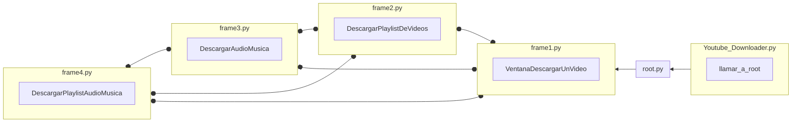

# Programa para descargar vídeos de YouTube

----

Script creado en Python para descargar vídeos de YouTube en la máxima resolución, simplemente copiando y pegando el enlace del vídeo.

<p align="center">
  
</p>

Tenemos disponible la versión .exe (la que viene comprimida en formato zip) y la versión .py para tener acceso al código del programa.

Los vídeos de YouTube se descargarán en el mismo directorio donde se encuentra ubicado el programa.

----
### Funcionamiento:




----

### Clonar con:
```batch
git clone https://github.com/Maalfer/Youtube_Downloader.git
```
y acceder a la carpeta con:
```batch
cd Youtube_Downloader
```
----

### Instalacion de librerias:

```batch
pip install -r requirements.txt
```

----

### Lectura del archivo README.md y LICENSE
- Para Windows:

```batch
type README.md | more
type LICENSE | more
```

- Para Linux:
```bash
cat README.md | more
cat LICENSE | more
```
----
### Ejecutar con:

```batch
python Youtube_Downloader.py
```

- En caso de que usted use Windows y no tenga `python` instalado:
```batch
start Youtube_Downloader.exe
```

----

### Generar un ejecutable con:

```batch
pyinstaller --onefile -i youtube.ico  Youtube_Downloader.py
```
Si fuera necesario. El archivo .exe generado se encuentra alojado en la carpeta "`dist`", esta se ubica donde se encontraba el script `Youtube_Downloader.py`. Si se les da la casualidad de que se les genera un error similar a este:
<p align="center">
  
</p>

Es debido a que el archivo `youtube.png` y el ejecutable han de ir juntos, y la imagen a de tener el mismo nombre. Para solucionarlo basta con mover el `.exe` a la misma carpeta en la que se encuentra la imagen.

----